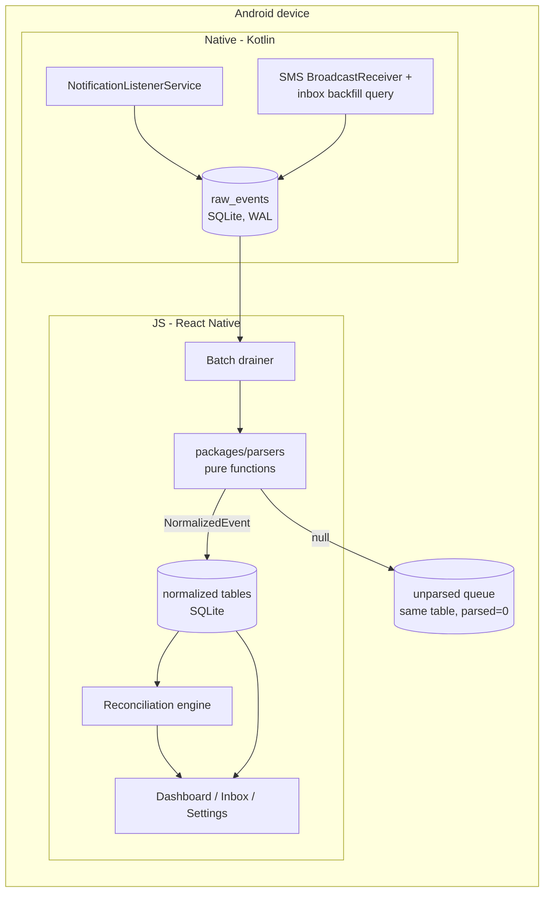

# hisaab — Technical Design

**Status:** v1.0 (companion to [PRD](./PRD.md))
**Related docs:** [PRD](./PRD.md) · [UX design](./UX-DESIGN.md) · [Instrumentation plan](./INSTRUMENTATION.md)

## 1. System overview

Everything runs on the worker's phone. There is no server, no external API, and no network call in the v1 binary.



Design invariants (from PRD §5):

1. Raw events are persisted **before** any parsing. Parse failures lose nothing.
2. Parsers are pure `(input) => NormalizedEvent | null` — no I/O, no Date.now(), no locale access; everything comes in via the input.
3. `parsers`, `core`, `cli` have zero React Native dependencies and run on plain Node (Linux CI).
4. Zero network: the app declares no `INTERNET` permission in v1. This is the strongest verifiable privacy claim an Android app can make — reviewers can confirm it from the manifest alone.

## 2. Monorepo & package boundaries

```
hisaab/
├── packages/
│   ├── core/        # Apache-2.0. Types (Zod schemas), aggregation, reconciliation logic
│   ├── parsers/     # Apache-2.0. Platform parsers + fixtures. Depends only on core.
│   ├── cli/         # Apache-2.0. Fixture harness. Depends on core + parsers.
│   └── app/         # AGPL-3.0. RN app + Kotlin native module. Depends on core + parsers.
├── docs/
├── CONTRIBUTING.md · CLAUDE.md · PRIVACY.md
```

- pnpm workspaces + TypeScript project references; `tsc --build` at root.
- Dependency direction is one-way: `app → parsers → core`, `cli → parsers → core`. CI enforces (no `react-native` in core/parsers/cli lockfile subtrees).
- Tooling: Vitest, Biome, TypeScript strict, conventional commits. CI (GitHub Actions): lint → typecheck → tests → fixture coverage report → license audit (fails on non-OSI dependency licenses).

## 3. Parser contract (`packages/parsers`)

```ts
// core
export interface RawInput {
  source: 'notification' | 'sms';
  packageName?: string;        // notifications: e.g. 'in.swiggy.deliveryapp'
  sender?: string;             // sms: e.g. 'VM-HDFCBK'
  title?: string;
  text: string;                // notification text/bigText or SMS body
  postedAt: string;            // ISO 8601 with offset (from notification postTime / SMS date)
  appVersion?: string;         // platform app versionName when resolvable
}

export type NormalizedEvent = Earning | IncentiveEvent | PayoutCredit; // Zod-validated

export type Parser = (input: RawInput) => NormalizedEvent | null;
```

- **Registry:** `parsers/src/index.ts` maps `packageName` / SMS sender patterns → ordered parser list. First non-null wins. Unknown package/sender → `null` → unparsed queue.
- **One file per notification type** per platform (e.g. `swiggy/order-delivered.ts`, `swiggy/incentive-progress.ts`), language variants handled inside the file with variant fixtures.
- **Fixtures:** JSON pairs in `parsers/fixtures/<platform>/<type>.<lang>.<n>.json` — `{ input: RawInput, expected: NormalizedEvent | null }`, anonymized per PRD §11 rules. Every parser change requires fixtures. Each platform dir carries `SUPPORTED_VERSIONS.md`.
- **Coverage:** `cli` computes fixture pass rate and (given a directory of captured raw events) parse coverage % — the same computation the app runs on-device for diagnostics ([Instrumentation §3](./INSTRUMENTATION.md)).
- **Versioning:** parsers package is semver'd; a `PARSER_PACK_VERSION` constant is stored with each parsed row so re-parsing after upgrades is traceable.
- **Re-parse pipeline:** when the parsers package updates, the app re-runs new parsers over the unparsed backlog (never over already-parsed rows unless a migration says so). This is how community fixture contributions retroactively rescue missed earnings.

## 4. Data layer

SQLite (via `op-sqlite`), WAL mode, single DB file in app-private storage.

```sql
-- migrations tracked via PRAGMA user_version + ordered migration files
CREATE TABLE raw_events (
  id INTEGER PRIMARY KEY,
  source TEXT NOT NULL,               -- 'notification' | 'sms'
  package_name TEXT, sender TEXT,
  title TEXT, text TEXT NOT NULL,
  posted_at TEXT NOT NULL,            -- ISO 8601
  captured_at TEXT NOT NULL,
  app_version TEXT,
  parsed INTEGER NOT NULL DEFAULT 0,  -- 0 unparsed, 1 parsed, 2 parse_error, 3 ignored
  parser_pack_version TEXT,
  contributed INTEGER NOT NULL DEFAULT 0,
  dedupe_key TEXT                     -- see UX E1
);
CREATE INDEX idx_raw_parsed ON raw_events(parsed, posted_at);

CREATE TABLE earnings (
  id INTEGER PRIMARY KEY,
  raw_event_id INTEGER REFERENCES raw_events(id),
  platform TEXT NOT NULL, kind TEXT NOT NULL,        -- order|trip|job|shift|adjustment
  gross_amount INTEGER NOT NULL,                     -- paise, never floats
  tips INTEGER, surge INTEGER, net_payout INTEGER,
  distance_km REAL, external_id TEXT,
  occurred_at TEXT NOT NULL, day TEXT NOT NULL,      -- day = Asia/Kolkata calendar date
  superseded_by INTEGER REFERENCES earnings(id)      -- revision trail (UX E3)
);
CREATE UNIQUE INDEX idx_earn_dedupe ON earnings(platform, external_id)
  WHERE external_id IS NOT NULL AND superseded_by IS NULL;

CREATE TABLE incentive_events ( ... promised_amount, credited_amount, criteria_text ... );
CREATE TABLE payout_credits (
  id INTEGER PRIMARY KEY, raw_event_id INTEGER,
  source TEXT NOT NULL, amount INTEGER NOT NULL, credited_at TEXT NOT NULL,
  match_status TEXT NOT NULL DEFAULT 'unmatched'     -- unmatched|auto|confirmed|ambiguous
);
CREATE TABLE payout_matches ( payout_credit_id, platform, cycle_start, cycle_end, confidence REAL );
CREATE TABLE expenses ( id, category, amount, occurred_at, day, note );
CREATE TABLE diagnostics_log ( id, event TEXT, at TEXT, props TEXT );  -- local-only, see Instrumentation
```

- **Money is integer paise.** No floats anywhere in money paths.
- **Days** are precomputed `Asia/Kolkata` calendar dates for cheap aggregation (`SELECT day, SUM(...) GROUP BY day`).
- **Migrations:** ordered TS migration files, run in a transaction at boot; `user_version` gate; failure path = safe-mode screen with raw export (UX §5.3). Every migration lands with an up-test in CI from a seeded fixture DB.
- **Retention:** raw text of parsed events prunable after 90 days (user setting, default on); normalized rows kept forever; unparsed raw kept until contributed/dismissed (UX E10).
- **Backup:** `android:allowBackup="false"` — Google auto-backup would silently copy the DB to Google's cloud and break the on-device pledge. Restore story is manual export/import (UX E11).

## 5. Native capture module (Kotlin)

### 5.1 NotificationListenerService

- Filters by the platform-package allowlist chosen at onboarding (plus superset of known wave-1 packages).
- Extracts `packageName`, `postTime`, `title`, `text`, `bigText`, style extras; resolves platform `versionName` (cached per package per day).
- Writes **directly and synchronously** into `raw_events` (SQLite handles cross-thread WAL writes; the listener does no parsing, no JS work — capture must survive the RN runtime not being up).
- Dedupe at capture: `dedupe_key = hash(packageName, title, text, postTime/90s bucket)`; repeat posts update, not insert.
- On `onListenerConnected` after a disconnect: insert a gap marker event (UX E2).

### 5.2 SMS capture (opt-in)

- Runtime permissions `RECEIVE_SMS` + `READ_SMS` requested only from the SMS opt-in screen; every SMS code path is behind the grant check.
- BroadcastReceiver for live messages; one-time inbox backfill (last 30 days) on grant via `Telephony.Sms.Inbox`, filtered by a sender-pattern allowlist (bank/UPI DLT headers like `%-HDFCBK`, `%-SBIINB`, GPay/PhonePe/Paytm patterns) — non-matching SMS are never read into the app's tables.
- Same `raw_events` sink as notifications.

### 5.3 JS bridge (the only "API contract" in a serverless app)

```ts
interface CaptureModule {
  getCaptureStatus(): Promise<{ notificationAccess: boolean; smsGranted: boolean; lastEventAt: string | null }>;
  openNotificationAccessSettings(): void;
  requestSmsPermission(): Promise<boolean>;
  runSmsBackfill(days: number): Promise<{ imported: number }>;
  getOemInfo(): Promise<{ manufacturer: string; knownAggressive: boolean }>;
  emitTestNotification(): Promise<void>;      // "Test it" in OEM flow
}
```

Raw-event flow needs no bridge marshalling: native writes SQLite, JS reads SQLite. The drainer is a JS routine (app-foreground + a WorkManager-triggered headless JS task, at most a few times daily) that parses `parsed = 0` rows in batches and writes normalized rows in a transaction.

### 5.4 Battery & reliability

- No wakelocks, no foreground service in v1 (listener + WAL writes are cheap); revisit only with pilot evidence.
- OEM hardening: detect aggressive OEMs (§UX 3.7), guide autostart/battery settings, verify via `emitTestNotification` round-trip.
- Reboot: listener re-binds via system; boot-completed receiver records a gap marker.

## 6. Aggregation (`packages/core`)

Pure functions over query results: net per day/week/platform, promised-vs-credited incentive gap, expense overlays. All date math in `Asia/Kolkata` via date-fns; week = Mon–Sun. Views are SQL-first (SUM/GROUP BY), core functions shape/format only — keeps low-end devices fast.

## 7. Reconciliation engine (F3)

Runs locally after each drain when SMS is enabled:

1. Build per-platform expected payout for a cycle: `SUM(net_payout ?? gross)` over the platform's payout window (per-platform config in parsers: e.g. weekly Mon–Sun, paid Wed).
2. Candidate credits: `payout_credits` within cycle-end + 5 days, amount within ₹1 tolerance of expected, or matching platform-labelled narration (e.g. "SWIGGY" in bank narration) at any amount.
3. Score: narration match > exact amount > amount-within-5%. One clear winner → `auto` match. Multiple candidates or partial amounts → `ambiguous` → Inbox "needs your confirmation" (UX E6). Worker confirmation → `confirmed` (training data for local heuristics only).
4. Gap = promised − received per cycle, surfaced per UX §3.5. Adjustments/penalties (negative earnings, E4) reduce "promised" so gaps aren't false alarms.

## 8. Privacy & security engineering

- **No `INTERNET` permission** in the v1 manifest (the headline verifiable claim). External links (GitHub, "verify this") open via intents in the system browser.
- `allowBackup=false`; DB and exports in app-private storage; exports leave only via user-invoked share/SAF.
- No third-party SDKs beyond the OSS libraries in PRD §10; CI license/dependency audit; Dependabot.
- Crash handling: local-only crash log (file ring buffer) viewable/shareable from Diagnostics — no crash reporter service.
- Anonymizer (F5) is a pure function in `core` with its own fixture tests (names, phones, addresses, IDs, vehicle numbers — EN/HI/KN patterns).
- Threat model note: a phone-thief with an unlocked phone sees earnings data; mitigation = optional app-lock (system biometric prompt) on the roadmap, not v1.

## 9. Build, release & rollout

- **Build:** GitHub Actions builds a signed release APK (signing key in repo secrets; key fingerprint published in README so sideloaders can verify). Reproducible-build parity is a stated goal for the F-Droid submission.
- **Versioning:** semver app releases; parsers package versioned independently but pinned per app release.
- **Distribution (v1):** GitHub Releases APK + WhatsApp-shareable link. **No in-app update check** (it would be a network call): updates are announced in the pilot WhatsApp group and by an in-app "installed X months ago" nudge that links to GitHub (browser intent).
- **Rollout stages, matching PRD §18 gates:** maintainer devices (Phase 2–3) → 10-worker friendly alpha (Phase 4 entry) → 50–100 Bengaluru pilot (Phase 4 exit). Each stage must hold ≥90% parse coverage on the previous cohort before widening.
- **Device test matrix:** at minimum one MIUI, one ColorOS/FuntouchOS, one stock-ish Android (Moto/Pixel), Android 9 → 15.
- **Play Store later:** a `notificationOnly` build flavor (no SMS permissions in manifest) is planned from the start so the Play variant is a build flag, not a fork.

## 10. Testing strategy

| Layer | How |
|---|---|
| Parsers | Vitest fixture tests (every fixture must pass); coverage % gate in CI; mutation-style checks for amount extraction |
| Core (aggregation, reconciliation, anonymizer) | Pure-function unit tests incl. midnight/week/timezone edges, paise rounding, revision supersedence |
| Migrations | Seeded-DB upgrade tests per migration in CI |
| Native capture | Small instrumented test set (listener insert, dedupe, gap marker) run on emulator in CI; OEM behavior manually via device matrix |
| App UI | Component tests for states in UX §5 (empty/denied/error); manual test script per release (EN/HI/KN screenshot pass) |
| E2E | `cli` replay: feed a day's captured raw events through the full parse→aggregate path and diff against expected dashboard numbers |

## 11. Key decisions & alternatives considered

| Decision | Alternative rejected | Why |
|---|---|---|
| RN + TS parsers shared app/CLI/CI | Native Kotlin app | Contributor pool + one parser codebase everywhere (PRD Q&A) |
| Native writes SQLite directly; JS reads | Bridge event streaming to JS | Capture must not depend on RN runtime being alive |
| No INTERNET permission | "We promise we don't call home" | Verifiable > promised |
| Integer paise | Floats/decimal strings | Money correctness |
| `allowBackup=false` | Default auto-backup | Auto-backup silently uploads the DB to Google Drive |
| No in-app update check in v1 | Update ping to GitHub | Any network call breaks the zero-network claim |
| op-sqlite | react-native-quick-sqlite | Actively maintained successor, better perf; both MIT |
